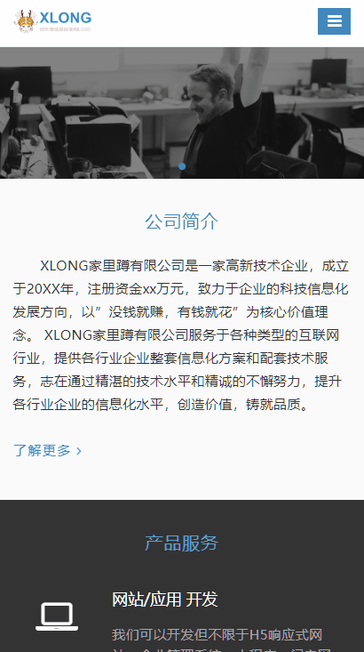
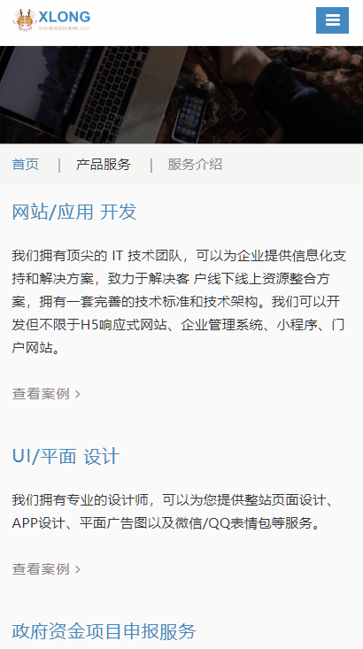
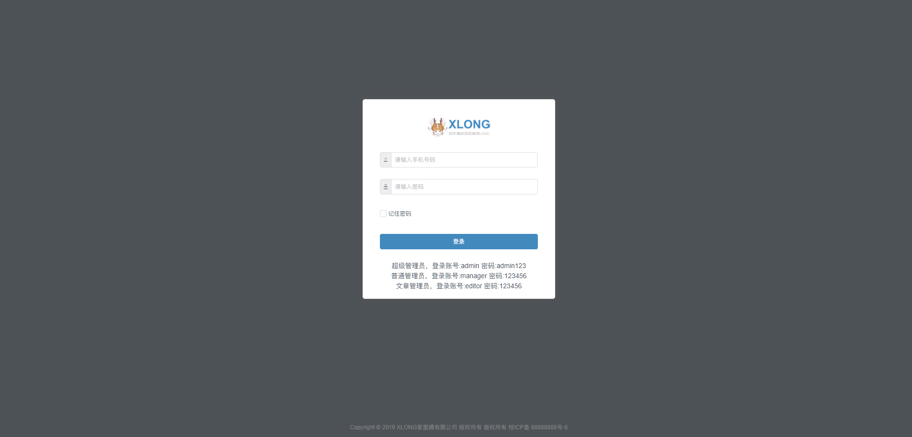
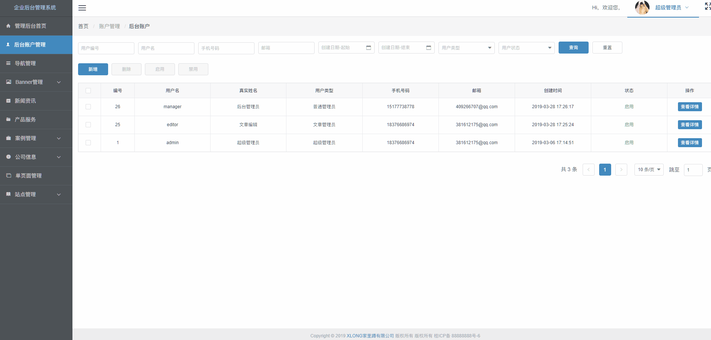
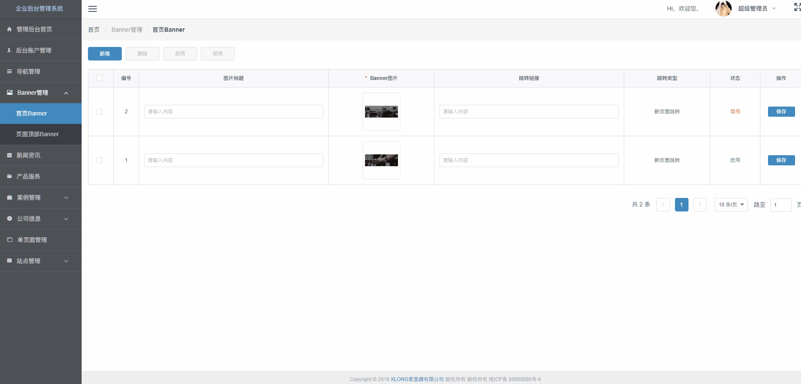

# xlong-website-cms

## 介绍

xlong-website-cms 是一套基于Egg + Vue + Webpack 开发的多页面和单页面服务端客户端渲染的企业CMS系统，可用于企业网站，微信微网站的实现。前台页面可响应式匹配各种移动设备。

## 迭代说明

#### 2019-09-29
1. 移除jQuery插件，侧边栏组件改用原生JS方法重写，通过路由“siderbarName”来匹配高亮状态
2. 添加404页面和“可编辑表格”组件
3. 优化项目结构

#### 2020-04-25
1. 修复BUG：登录信息失效一直保留在404页面的问题 
2. 修复BUG：首页Banner和顶部Banner无法编辑图片 
3. 修复BUG：列表设置“显示在首页”操作时，多选selectList重复取值
4. 修复BUG：侧边栏菜单二级菜单未开启accordion时箭头动画有误  
5. 修复BUG：侧边栏菜单选择菜单边缘时路由不跳转，仅在选中文本时才跳转  
6. 修复BUG：侧边栏菜单一级菜单下的2个二级菜单互相添砖时，高亮状态有误
7. 修复BUG：C端“图标展示”页面，图标数据显示不全  
8. 修复BUG：图片裁剪BUG，无法显示裁剪框
9. 修复BUG：列表设置“显示在首页”操作时，多选selectList重复取值
10. 优化：侧边栏菜单setActive多次调用问题，只调用1次，提高性能

## 项目说明

#### 1. 前后端分离开发模式
- **前端**
    - **企业网站**：Egg + Nunjucks, 服务端渲染，多页面响应式应用开发
    - **管理后台**：Vue + Webpack+ iView, 客户端渲染，单页应用开发
- **后端**：Egg + SQLite

#### 2. 项目用到技术、框架与插件
[Node.js](https://github.com/nodejs)  
[Egg.js](https://github.com/eggjs)  
[Vue.js](https://github.com/vuejs)  
[Tinymce](https://github.com/tinymce/tinymce)  
[webpack](https://github.com/webpack)  
[iView](https://github.com/iview/iview)  
[egg-view-nunjucks](https://github.com/eggjs/egg-view-nunjucks)  
[egg-cors](https://github.com/eggjs/egg-cors)  
[node-sqlite3](https://github.com/mapbox/node-sqlite3)  

#### 3. 浏览器兼容性
由于是响应式页面，PC和移动设备都能统一访问，并且用到了部分版本比较高的插件，所以主要兼容浏览器：IE10+、IE Edge、Safai、Firefox、Chrome等。

## 部分项目运行截图
* 前台页面






* 后台页面








## 前台展示的功能列表

- **首页**：轮播图、公司简介、产品服务列表、新闻资讯
- **关于我们**
  - **公司介绍**
  - **公司团队**
- **新闻资讯**：文章列表
- **产品服务**
    - **服务介绍**：信息列表
    - **案例展示**：案例列表
- **联系我们**：信息列表

## 后台管理的功能列表

账户分超级管理、普通管理员和文章管理员，不同角色拥有不同的操作权限

- **后台账户管理**
- **导航管理**
- **Banner管理**
  - **首页Banner**：首页轮播图
  - **页面顶部Banner**：其他页面顶部图片
- **新闻资讯**
- **产品服务**：产品服务信息内容
- **案例管理**
  - **案例分类**
  - **案列列表**
- **公司信息**
  - **公司介绍**：公司介绍页面内容
  - **公司团队**：公司团队页面内容
  - **联系我们**：联系我们页面内容
- **单页面管理**：单页面内容
- **站点管理**
  - **站点信息**：站点LOGO、公司名称、版权信息等
  - **友情链接**：页面底部友情链接
  - **底部信息**：页面底部信息设置

## 目录结构
#### 1. websiteCmsClient 服务端，前台项目

```
│  .autod.conf.js
│  .gitignore
│  .travis.yml
│  app.js // 项目启动配置，连接数据库
│  appveyor.yml
│  package.json
│  README.md
│
├─.vscode // vscode配置，用于配置less
│
├─database
│  websiteCms.db // SQLite数据库
│  数据库设计.docx // 数据库设计文档
│
├─app
│  │  router.js // 路由配置
│  │
│  ├─controller
│  │  │  admin.js // 后台相关controller
│  │  │  home.js // 前台相关controller
│  │  │
│  │  └─api // api服务，主要是为了给后台使用
│  │     accountService.js // 账户管理相关controller
│  │     articleService.js // 文章管理相关controller
│  │     clientService.js // 客户端管理相关controller
│  │     infoService.js // 信息管理相关controller
│  │     productService.js // 产品服务相关controller
│  │     storageService.js // 存储服务controller
│  │     userService.js // 用户信息管理相关controller    
│  │
│  ├─extend
│  │     helper.js // 用来提供一些实用的 utility 函数
│  │
│  ├─public
│  │  │
│  │  ├─admin // 后台项目资源
│  │  │  └─dist // 打包后生成目录文件
│  │  │
│  │  ├─common // 通用模块
│  │  │
│  │  ├─upload // 上传文件存储位置
│  │  │
│  │  └─home // 前台项目静态资源
│  │
│  ├─service // 用来执行具体的操作
│  │    sqliteDB.js // Sqlite查询封装方法
│  │    ccount.js // 账户相关服务 
│  │    article.js // 文章相关服务
│  │    client.js // 客户端相关服务
│  │    common.js // 通用服务 
│  │    home.js // 前台服务
│  │    info.js // 信息相关服务
│  │    product.js // 产品相关服务 
│  │    user.js // 用户相关服务
│  │
│  └─view // 模板文件
│       └─home // 前台模板文件
│
├─config
│     config.default.js // 项目配置相关
│     plugin.js // 插件
│
└─test // 测试相关
    └─app
        └─controller
            home.test.js
```

#### 2. websiteCmsAdmin 后台项目

```
│  .babelrc
│  .editorconfig
│  .postcssrc.js
│  .gitignore
│  index.html // 首页入口文件
│  package.json
│  README.md
│
├─.vscode // vscode配置，用于配置less
│
├─src
│  │  main.js // 项目入口js
│  │  app.js // 根组件
│  │
│  ├─assets // 资源目录，这里的资源会被wabpack构建
│  ├─api // api接口文件
│  ├─theme // iView主题样式
│  ├─store  应用级数据（state） 
│  │
│  ├─mock // 测试数据
│  │    city.json // 省市数据
│  │
│  ├─components // 功能组件
│  │  |
│  │  ├─Common // 通用组件
│  │  └─Image // 图片相关组件
│  │
│  ├─pages // 页面组件
│  │    AccoutnManage.vue // 账户管理
│  │    ArticleManage.vue // 文章管理
│  │    ...
│  │    SecondPane.vue // 用来显示三级路由的容器
│  │    Main.vue // 主框架
│  │
│  ├─mixins // 混合模块
│  │    city_select.js // 城市联级选择
│  │    email_complete.js // 文章管理
│  │    keyword_model.js // 关键词弹窗
│  │    page.js // 页码配置
│  │    store_model.js // 存储弹窗
│  │    table_operate.js // 表格操作
│  │    table_query.js // 表格查询
│  │    upload_img.js // 上传图片
│  │
│  ├─common // 通用js模块
│  │    common.js // 通用工具
│  │    table_setting.js // 封装一些iView表格按钮渲染
│  │    validate.js // 封装一些iView表单验证方法
│  │  
│  ├─utils 
│  │    index.js // 封装一些工具函数
│  │    request.js// 封装axios请求等工具  
│  │
│  └─router // 路由配置
│       index.js
│       routes.js
│
├─static // 静态资源
│
├─config // 配置目录，包括端口号
│
└─build // 项目构建(webpack)相关代码
```

## 本地运行
需要安装SqLite数据库和Node.js环境，建议先启动前台项目再启动后台项目。

#### 前台项目
1. 进入前台目录
> cd ./websiteCmsClient
2. 安装前台依赖
> npm install
3. 运行前台项目
> npm run dev
4. 访问地址：http://localhost:6060/index

#### 后台项目
1. 进入后台目录
> cd ./websiteCmsAdmin 
2. 安装后台依赖  
> npm install 
3. 运行后台项目  
> npm run dev
4. 访问地址：http://localhost:6061/admin

* 代理请求已经配置好，可在config下配置proxyTable更改

## 打包后台项目
1. 在 websiteCmsAdmin 项目下  
> npm run build
2. 将打包好的dist文件复制到'websiteCmsClient\app\public\admin'目录下  
3. 在 websiteCmsClient 项目启动  
> npm run dev

* 打包后启动 websiteCmsClient 可以通过 http://127.0.0.1:6060/index 和 http://127.0.0.1:6060/admin 来访问前台和后台

## 应用部署

#### 构建

> cd ./websiteCmsClient  
> npm install --production  
> tar -zcvf ../release.tgz .  

构建完成后打包成 tgz 文件，部署的时候解压启动就可以了。

#### 部署
Egg框架内置了 egg-cluster 来启动 Master 进程，Master 有足够的稳定性，不再需要使用 pm2 等进程守护模块。

同时，框架也提供了 egg-scripts 来支持线上环境的运行和停止。

启动命令：
> egg-scripts start --port=7001 --daemon --title=egg-server-showcase

## 作者联系方式
QQ：381612175
TEL: 18376686974

github：https://github.com/xLong1029/

站酷主页：http://xlong.zcool.com.cn/

UI中国：http://i.ui.cn/ucenter/358591.html

* 此项目做学习Egg.js测试使用，有什么问题可联系我讨论